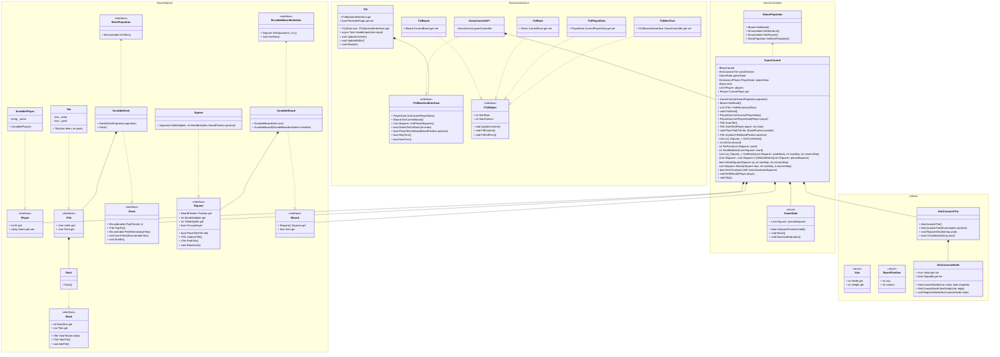

# Scrabble

Scrabblin scrabblelin

## new design

```mermaid
classDiagram
namespace GameObjects{
    class IPlayer{
        <<interface>>
        + int ID get;
        + string Name get;set;
    }
    class ITile{
        <<interface>>
        + char Letter get
        + char Point get
    }
    class IDeck{
        <<interface>>
        + IEnumberable<ITile> PopTiles(int n)
        + ITile PopTile()
        + IEnumerable<ITile> PeekRemainingTiles()
        + void InsertTiles(IEnumerable<ITile> tiles)
        + void Shuffle()
    }

    class ISquare{
        <<interface>>
        + BoardPosition Position get
        + int WordMultiplier get
        + int TileMultiplier get
        + bool PlaceTile(ITile tile)
        + ITile UnplaceTile()
        + ITile PeekTile()
        + bool Occupied get
        + void Deactivate()
    }
    class IBoard{
        <<interface>>
        + ISquare[,] Squares get
        + Size Size get
    }
    class IRack{
        <<interface>>
        + int RackSize get
        + List<ITile> Tiles get
        + ITile TakeTile(int index)
        + ITIle TakeTile()
        + void AddTile()
    }


    %% implementations
    class ScrabblePlayer{
        - string _name
        + ScrabblePlayer()
    }
    class Tile{
        - char _letter
        - char _point
        + Tile(char letter, int point)
    }
    class Square{
        + Square(int tileMultiplier, int WordMultiplier, BoardPosition position)
    }
    class ScrabbleDeck{
        + Deck(IDeckPopulator populator)
        + Deck()
    }
    class IDeckPopulator{
        <<interface>>
        + IEnumerable<ITile> GetTiles()
    }
    class ScrabbleBoard{
        + ScrabbleBoard(Size size)
        + ScrabbleBoard(IScrableBoardInitializer initializer)
    }
    class IScrabbleBoardInitializer{
        <<interface>>
        + ISquare GetSquare(int i, int j)
        + Size GetSize()
    }
    class Rack{
        + Rack()
    }
}
namespace Utilities{
    class Size{
        <<struct>>
        + int Width get
        + int Height get
    }
    class BoardPosition{
        <<struct>>
        + int row
        + int column
    }
    class AhoCorasickTrie{
        + AhoCorasickTrie()
        + AhoCorasickTrie(IEnumerable<string> wordList)
        + void RegisterWord(string word)
        + bool CheckWord(string word)
    }
    class AhoCorasickNode{
        + AhoCorasickNode(char value, bool stopable)
        + AhoCorasickNode NextNode(char edge)
        + void RegisterNode(AhoCorasickNode node)
        + char Value get set
        + bool Stopable get set
    }
}

namespace GameController{
    class IGamePopulator{
        + IBoard GetBoard()
        + IEnumerable<string> GetWordList()
        + IEnumerable<IPlayer> GetPlayers()
        + IDeckPopulator GetDeckPopulator()
    }
    class GameControl{
        - IBoard board
        - AhoCorasickTrie wordChecker
        - GameState gameState
        - Dictionary~IPlayer,PlayerData~ playerData
        - IDeck deck
        - List~IPlayer~ players

        + GameControl(IGamePopulator populator)
        + IBoard GetBoard()
        + List~ITile~ GetRemainingTiles()
        + IPlayer CurrentPlayer get
        + void FirstDeal()
        + PlayerData GetCurrentPlayerData()
        + PlayerData GetPlayerData(IPlayer player)
        + ITile DrawTile()
        + ITile TakeTile(IPlayer player, int index)
        + void PlaceTile(ITile tile, BoardPosition position)
        + ITile UnplaceTile(BoardPosition position)
        - List~List_ISquare_~ GetTurnWords()
        + int GetTurnScore()
        - int TilePoint(List~ISquare~ word)
        - int TotalMultiplier(List~ISquare~ word)
        - List~List_ISquare_~ GetWords(List~ISquare~ wordStarts, int rowStep, int columnStep)
        - (List~ISquare~, List~ISquare~) GetWordStarts(List~ISquare~ placedSquares)
        - bool IsStartSquare(ISquare sq, int rowStep, int columnStep)
        - List~ISquare~ Beam(ISquare start, int rowStep, it columnStep)
        + bool NextTurn(bool refill, bool deactivateSquares)
        + void RefillRack(IPlayer player)
        + void Skip()
    }

    class GameState{
        <<struct>>
        + List~ISquare~ placedSquares
        + bool IsSquarePositionsValid()
        + void Reset()
        + void DeactivateSquares()
    }
}

namespace TextUserInterface{
    class GameControlAPI{
        - GameControl gameController
    }
    class ITUIBackendInterface{
        <<interface>>
        + PlayerData GetCurrentPlayerData()
        + IBoard GetCurrentBoard()
        + List~ISquare~ GetPlacedSquares()
        + bool SelectTileOnRack(int index)
        + bool PlaceTileOnBoard(BoardPosition position)
        + bool SkipTurn()
        + bool NextTurn()
    }
    class TUI{
        - ITUIBackendInterface api
        + TUI(Size size, ITUIBackendInterface api)
        + bool RerenderFlage get set
        + async Task HandleInput(char input)
        + void UpdateContent()
        + void UpdateBuffer()
        + void Render()
    }
    class ITUIObject{
        <<interface>>
        + int StartRow
        + int StartColumn
        + void UpdateContent()
        + void FillContent()
        + void FillCellFunc()
    }
    class TUIBoard{
        + IBoard CurrentBoard get set
    }
    class TUIRack{
        + IRack CurrentRack get set
    }
    class TUIPlayerData{
        + PlayerData CurrentPlayerData get set
    }
    class TUINextTurn{
        + ITUIBackendInterface GameController get set
    }
}

%% TUI
TUIBoard ..|> ITUIObject
TUIRack ..|> ITUIObject
TUIPlayerData ..|> ITUIObject
TUINextTurn..|> ITUIObject
GameControlAPI ..|> ITUIBackendInterface
GameControlAPI *-- GameControl
TUI *-- ITUIBackendInterface

%% GameControl to other namespaces

GameControl *-- AhoCorasickTrie
GameControl *-- IPlayer
GameControl *-- IDeck
GameControl *-- IBoard

%% GameControl

GameControl *-- GameState
IGamePopulator <.. GameControl

%% namespace utilities
AhoCorasickTrie *-- AhoCorasickNode

%% namespace game objects
ScrabblePlayer ..|> IPlayer
Tile ..|> ITile
Square ..|> ISquare
ScrabbleDeck ..|> IDeck
ScrabbleDeck *-- ITile
ScrabbleBoard ..|> IBoard
ScrabbleBoard *-- ISquare
Rack ..|> IRack
ITile *-- Rack
IDeckPopulator <.. ScrabbleDeck
IScrabbleBoardInitializer <.. ScrabbleBoard
```
